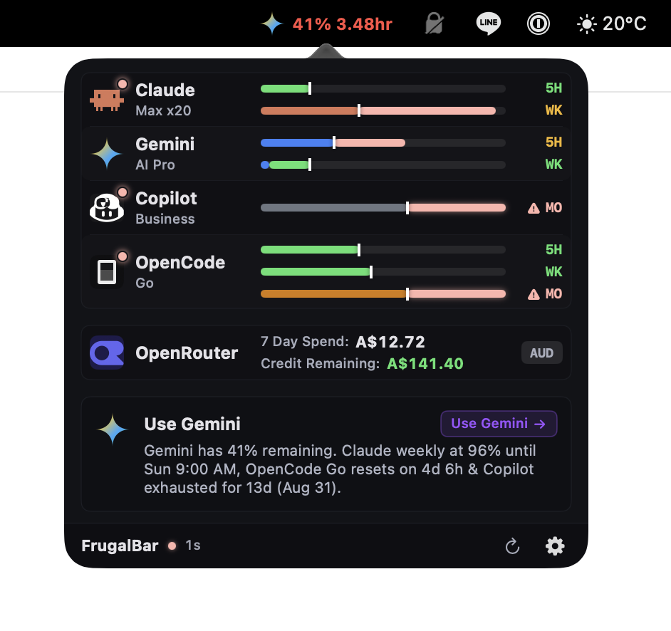

# frugalbar — track AI usage & dev limits

<p align="center">
  
</p>

A native macOS menu bar app that shows how much headroom you have left across AI subscriptions, API spend caps, and developer rate limits.

---

## Why FrugalBar?

Modern engineering workflows rely heavily on multiple AI models and developer platforms (Claude, OpenAI / OpenRouter, Google Gemini, GitHub Copilot, and GitHub APIs). However:

- **Surprise quota exhaustion**: Running multi-step autonomous agent runs or code generation tasks often grinds to a halt midway through a long job because a hidden rate limit or budget cap was breached.
- **Scattered dashboards**: Checking balances requires navigating half a dozen provider dashboards, consoles, and billing portals.
- **Inaccurate estimations**: Many tools guess or synthesize quotas. **FrugalBar never fakes a quota** — if a vendor publishes actual limit telemetry, it draws a real gauge; if not, it reports verified key status honestly without fabricated percentages.
- **Glanceable decision making**: With a discreet menu bar indicator and responsive dark popover, you know immediately whether you have enough headroom to kick off your next agent workflow or batch job.

---

## Installation & Distribution

### Homebrew (Recommended)

Install `frugalbar` in a single command:

```bash
brew install seankoji-com/tap/frugalbar
```

*(Or tap the repository first: `brew tap seankoji-com/tap && brew install frugalbar`)*

To start FrugalBar and have it launch automatically at login:
```bash
brew services start frugalbar
```

Or run it directly:
```bash
frugalbar &
```

### Direct Download & Swift Package

You can download prebuilt release binaries from [GitHub Releases](https://github.com/seankoji-com/frugalbar/releases) or run from source:

```bash
# Clone and run from source
git clone https://github.com/seankoji-com/frugalbar.git
cd frugalbar
swift run
```

---

## Quick Start & Configuration

1. Launch `frugalbar` or click the menu bar status icon.
2. Open **Preferences → API Keys** (gear icon).
3. Add your provider credentials:
   - **GitHub**: One PAT covers REST, GraphQL rate limits, and Copilot subscription status.
   - **OpenRouter**: Use a spend-capped API key to display live balance, budget, and spend telemetry.
   - **Google Gemini**: Connect Google OAuth for Antigravity subscription quota.
   - **Anthropic Claude**: Sign in with the Claude Code CLI; enable CLI discovery and FrugalBar reads that OAuth login.
   - **OpenCode**: Configure a token; usage appears once OpenCode has written its own telemetry.

Credentials are validated against live vendor endpoints upon saving to immediately catch typos or permission issues.

---

## What It Can Actually Measure

Not every vendor publishes usage telemetry. Where a vendor doesn't provide real consumption numbers, FrugalBar states so explicitly instead of fabricating an estimate:

| Provider | Source | Telemetry Provided |
|---|---|---|
| **GitHub REST** | `GET https://api.github.com/rate_limit` → `resources.core` | Live gauge: requests/hour remaining with reset countdown |
| **GitHub GraphQL** | `GET https://api.github.com/rate_limit` → `resources.graphql` | Live gauge: points/hour remaining with reset countdown |
| **OpenRouter** | `GET https://openrouter.ai/api/v1/auth/key`, then `GET https://openrouter.ai/api/v1/credits` | Live account credit balance in USD when the key may read it; otherwise that key's USD spend cap |
| **OpenAI / ChatGPT** | `GET https://chatgpt.com/backend-api/wham/usage` via the Codex session | Live rolling subscription window when local credential discovery is enabled |
| **GitHub Copilot** | `GET https://api.github.com/copilot_internal/v2/token` | Live gauge: monthly premium-request credits used, with reset date |
| **Google Gemini** | `cloudcode-pa.googleapis.com/v1internal` (Google OAuth) | Live Antigravity subscription quota per model; no CLI dependency |
| **OpenCode** | `~/.local/share/opencode/usage.json` | Shown only when OpenCode has written measured usage |
| **Anthropic Claude** | `anthropic-ratelimit-unified-*` response headers | Live 5-hour and 7-day quota from the Claude Code OAuth login |

### Caveats worth knowing

Two of these readings carry a cost the table can't show:

- **Claude spends a little of the quota it reports.** Anthropic publishes the unified 5h/7d figures only as response headers, so FrugalBar issues the smallest possible real request (one Haiku call capped at a single output token) on each refresh. It is a rounding error against a subscription, but it is not free, and it is why the poll interval is two minutes rather than two seconds.
- **Gemini uses Antigravity's OAuth client against a private API.** The `v1internal` Cloud Code endpoint is undocumented and the flow authenticates with Antigravity's own client ID. Google can change or revoke either without notice, in which case the Gemini row goes dark until FrugalBar is updated. The consent screen will not say "FrugalBar".

---

## Security & Keychain Architecture

- **macOS Keychain Storage**: Keys are stored locally in the secure Keychain (`kSecAttrAccessibleAfterFirstUnlockThisDeviceOnly`, never synced to iCloud or external clouds).
- **No In-URL Token Leaks**: API credentials are sent strictly in HTTP request headers, never query parameters.
- **Local CLI Discovery (Opt-in)**: Auto-detecting credentials from local developer tools (`gh auth token`, `~/.local/share/opencode/auth.json`) is **disabled by default** and can be enabled under **Preferences → General**.

---

## Development & Testing

```bash
# Build with zero-warning tolerance
swift build -Xswiftc -warnings-as-errors

# Run full test suite in parallel
swift test -c debug --parallel
```

CI runs on GitHub-hosted `macos-15` (Apple Silicon) with Xcode 16.

---

## Requirements

- macOS 15.0+ (Sequoia) or macOS 14.0+
- Swift 6.0+ (Xcode 16+)
- Apple Silicon or Intel Mac
